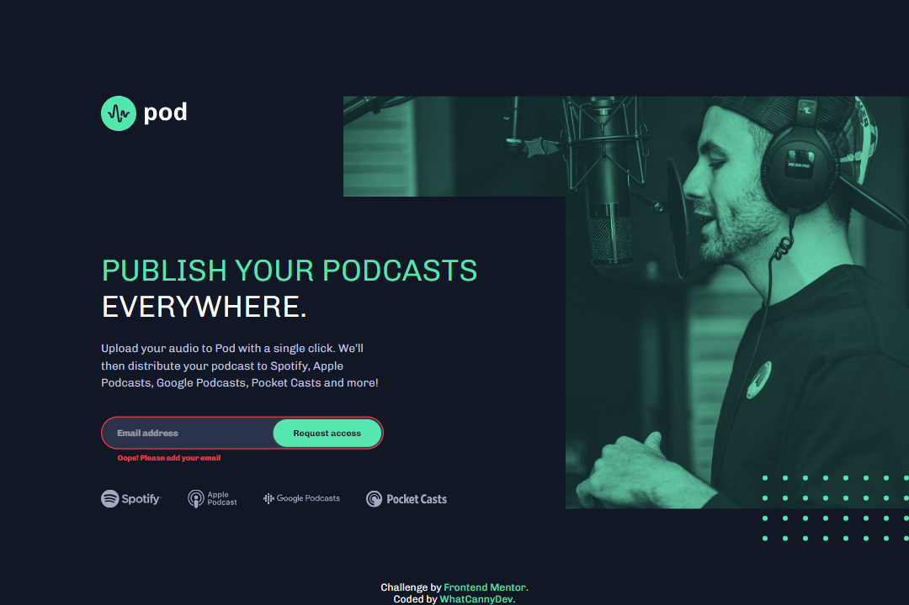

# Frontend Mentor - Pod request access landing page solution

This is a solution to the [Pod request access landing page challenge on Frontend Mentor](https://www.frontendmentor.io/challenges/pod-request-access-landing-page-eyTmdkLSG). Frontend Mentor challenges help you improve your coding skills by building realistic projects. 

## Table of contents

- [Overview](#overview)
  - [The challenge](#the-challenge)
  - [Screenshot](#screenshot)
  - [Links](#links)
- [My process](#my-process)
  - [Built with](#built-with)
  - [What I learned](#what-i-learned)
  - [Useful resources](#useful-resources)
- [Author](#author)

## Overview

### The challenge

Your challenge is to build out this early access landing page and get it looking as close to the design as possible.

You can use any tools you like to help you complete the challenge. So if you've got something you'd like to practice, feel free to give it a go.

Users should be able to:

- View the optimal layout depending on their device's screen size
- See hover states for interactive elements
- Receive an error message when the form is submitted if:
  - The `Email address` field is empty should show "Oops! Please add your email"
  - The email is not formatted correctly should show "Oops! Please check your email"

### Screenshot

### Links

- Solution Repository URL: [Click here](https://github.com/CannyRo/FrontendMentor_PodRequestAccessLandingPage_eyTmdkLSG)
- Live Site URL: [Click here](https://cannyro.github.io/FrontendMentor_PodRequestAccessLandingPage_eyTmdkLSG/)

## My process

### Built with

- Semantic HTML5 markup
- CSS custom properties
- Flexbox
- CSS Grid
- Mobile-first workflow
- Javascript vanilla

### What I learned

Redo the development of a file if its organization, structure, etc. are not suitable for future developments.

That's what I had to do for my CSS file, because certain classes that worked well on the mobile version were handicapping me for the desktop version.

The right way was the easiest. Remember KISS.

### Useful resources

- [What's KISS principle ?](https://medium.com/@amitrockach/the-kiss-principle-in-programming-simply-explained-47d2cf426f8f) - This is a simple reminder for KISS principle (Keep It Simple, Stupid).

## Author

- Website - [WhatCannyDev is searching a work-study contract in France](https://cannyro.github.io/hire_mr_canny/en)
- Frontend Mentor - [@CannyRo](https://www.frontendmentor.io/profile/CannyRo)
- GitHub - [@CannyRo](https://github.com/CannyRo)
- LinkedIn - [Ronan CANNY](https://www.linkedin.com/in/ronan-canny-b29443277/)
